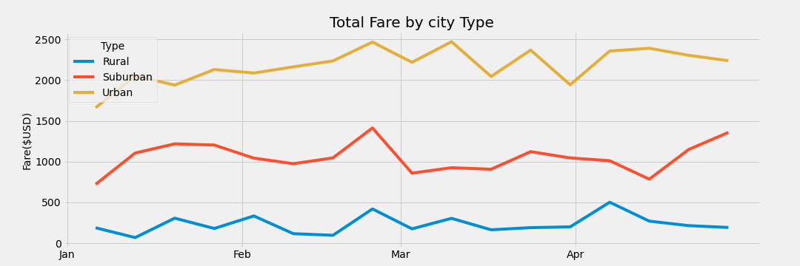
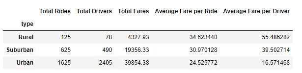

# PyBer_Analysis
## Project Overview
Take the PyBer data and analyze the weekly fares by city type
tasks
1. create a summary dataframe by city type
2. create a mulipule line chart of total fares for each city type

## Results

