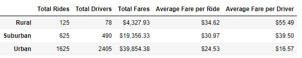

# PyBer_Analysis
## Project Overview
Take the PyBer data and analyze the weekly fares by city type
tasks
1. create a summary dataframe by city type
2. create a mulipule line chart of total fares for each city type

## Results
### PyBer Summary by City type

The summary data above shows that urban cities by far have the most drivers, total rides and total fares. Suburan  cities come in second in all those metrics and Rual cities come in last.

The average fare per ride and per driver however orders the cities in the opposite dirction, with Rual getting the most, then suburban and urban.
This is likely because rides in urban cities do not go as far as rural cities therefore have a lower average fare per ride.

The Total Fare by city Type graph above shows that the trend of each type of city is very similar, having a slight peak at the end of February but staying fairly flat overall.
The fares in Urban cities has more peaks and valleys, this could be due to different factors impacting the usage. Perhaps thease are peaking during the weekends or on days where the weather isnt nice.

## Summary
The Analysis shows that PyBer Drivers in urban cities get more rides but get paid far less than drivers in rual and suburban cities. This is due to the fact that there are more drivers, and the rides within the city are shorter therefore cost less. If the drivers in the city had higher rates or the drivers in the rural cities had slightly lower rates this would help even out the value each driver is geting paid for their work.
